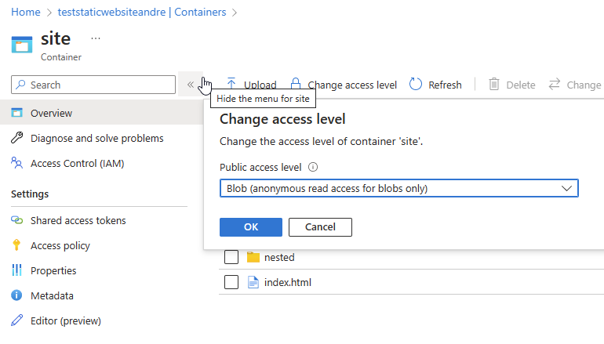

# Using Azure FrontDoor with private link to a Storage account for static web server purposes

## Overview

[Azure FrontDoor Premium](https://learn.microsoft.com/en-us/azure/frontdoor/front-door-overview) supports connecting to its backends privately by leveraging [private link](https://learn.microsoft.com/en-us/azure/frontdoor/private-link) service, and that includes Storage Accounts. However, if you are hosting websites in a Storage Account using its [Static Website](https://learn.microsoft.com/en-us/azure/storage/blobs/storage-blob-static-website) feature, you found the problem that it always makes your blob container (*$web*) publicly accessible.
So, how does one using Azure FrontDoor Premium with private link towards the storage account but still serve static website content, securely?

This article will guide you step-by-step how to do that. It is **not** the purpose of this article to discuss all the other alternatives to hosting static websites in Azure (for example, CDNs, Azure Static Web Apps and others)

## Prerequisites

1) An active Azure subscription

## Steps

1) Follow the steps in the [official FrontDoor documentation](https://learn.microsoft.com/en-us/azure/frontdoor/standard-premium/how-to-enable-private-link-storage-account) on how to enable private link to a Storage Account.

2) Up to this point, you only configured Front Door to communicate with your Storage Account without public traffic. Now, if you already had a created Storage Account with Static Website feature enabled when following the previous steps, you will need to **disable** it.

3) If you had your website files inside the $web container already, create another container and move them there. In my case, I created a new container named *site* and added my website files in it:

Set the new container Access level to **Blob (anonymous read-access to blobs only)**. This is important otherwise FrontDoor won't be able to access this blob without a SAS key. Don't worry, because the blobs won't actually be accessible anonymously but only through FrontDoor.

4) In the Storage Account properties, go to Networking and disable Public Network Access:

This will ensure that the blobs under *sites* container will not be directly accessible even we have configured its Access Level to *Blob (anonymous read-access to blobs only)*

5) Give it a few minutes and you should be able to access your website using the FrontDoor endpoint now, without using the Storage Account "Static website" feature. However, we lost a very important feature: the **default file** to be served when users access our domain. Now, people would need to type the full path to the *index* file: https://yourdomain.com/index.html. How can we have the same behavior now in FrontDoor? For that, we will use its [Rule set](https://learn.microsoft.com/en-us/azure/frontdoor/standard-premium/how-to-configure-rule-set) options. Go to *FrontDoor, menu Rule set -> Add* and add this rewrite rule:

After that is done, go to menu Rule Set again and associate this new rule set with the route for your backend.

6) And now you can visit your apex domain at https://yourdomain.com that the rules engine will rewrite the requests to serve index.html when it is empty! Similar configuration you can do for CORS headers if you need.

7) Now, I strongly recommend that you [enable caching](https://learn.microsoft.com/en-us/azure/frontdoor/how-to-configure-caching) in your endpoint. Without it, FrontDoor will fetch the blobs in your Storage Account for every request, which slow downs the initial page load of your site. 

## Conclusion
It was a short but useful article if you want to move away quickly from the simple Static Website feature on Storage Accounts and start using Azure FrontDoor for that. Not only your storage account is now private, you also gain all other possibilities with Azure Front Door Premium like:

- WAF
- Traffic reports
- Compression
- Caching
- Bot protection
- Ease of managing custom domains and managed HTTPS certificates